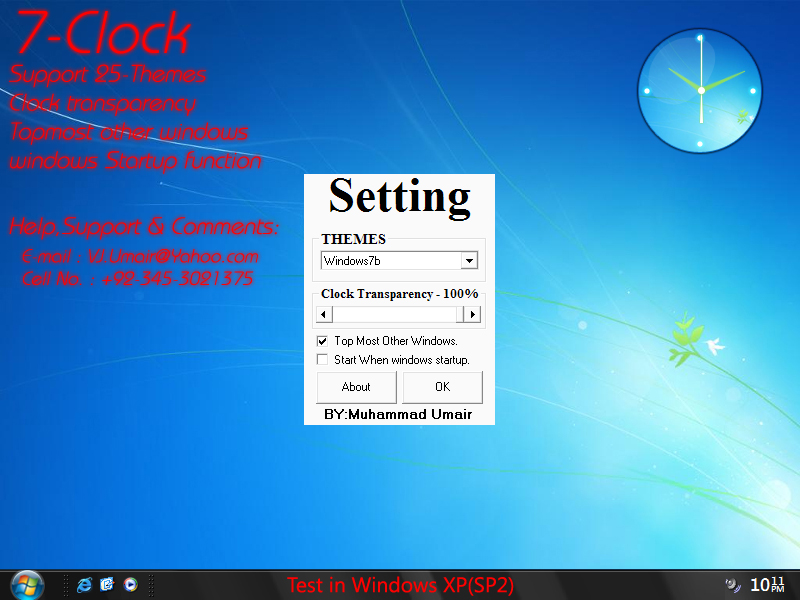



## Seven Clock

### Description

I Create New 7-Clock.It made Your Desktop Beautiful.25 Themes!

Just You Make .EXE &amp; enjoy!

Now Download EXE on:

http://vjumair.deviantart.com/art/7-Clock-130801957
 
### More Info
 
You can set the transparency level of 7-Clock.

All images are provided in .PNG format for full transparency/Quality.

When Start remembers its last Setting.(position &amp; THEME).

----

What's New in 7-Clock

----

Added Clock Opacity.

Added 25 Themes.

Added Save System Clock setting. (When Start remembers its last Setting)

Added "Top most other windows" option

Added "Start when windows startup" option

Lots Bugs Fixed.

IMPROVED clock refresh rate.

No Flickers Screen

----

User Operate Guide

----

----

Shortcut KEYS:

----

CTRL+S	=	Clock Setting Open.

CTRL+T	=	Top Most for other windows.

CTRL+E	=	Exit 7-Clock.

CTRL + Mouse(Button Pressed) Move = Move Clock Anywhere.

If You Can Find any Bug Please Sent me.

Phone No.: +92-345-3021375

Email: VJ.Umair@Yahoo.com

             |
---                |---
**Submitted On**   |2009-07-18 21:15:18
**By**             |[Muhammd Umair](https://github.com/Planet-Source-Code/PSCIndex/blob/master/ByAuthor/muhammd-umair.md)
**Level**          |Intermediate
**User Rating**    |4.8 (24 globes from 5 users)
**Compatibility**  |VB 6\.0
**Category**       |[Graphics](https://github.com/Planet-Source-Code/PSCIndex/blob/master/ByCategory/graphics__1-46.md)
**World**          |[Visual Basic](https://github.com/Planet-Source-Code/PSCIndex/blob/master/ByWorld/visual-basic.md)
**Archive File**   |[Seven\_Cloc2158397252009\.zip](https://github.com/Planet-Source-Code/muhammd-umair-seven-clock__1-72296/archive/master.zip)

